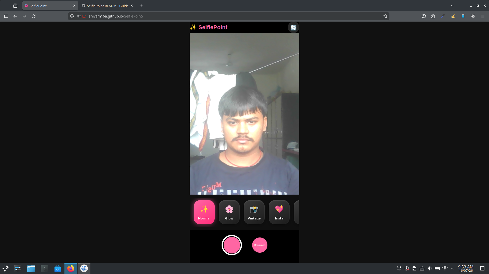

# 📸 SelfiePoint

<p align="center">
  
</p>

<p align="center">
  <strong>Capture beautiful selfies with stylish real-time filters directly in your browser.</strong>
</p>

<p align="center">


</p>

---

## ✨ Overview

**SelfiePoint** is a modern browser-based selfie camera application that allows users to capture high-quality selfies with multiple real-time camera filters.

No installation is required—simply open the website, allow camera permission, choose your favorite filter, capture the photo, and download it instantly.

---

## 🚀 Features

- 📷 Live Camera Preview
- 🎨 Multiple Real-Time Filters
- 💖 Animated Hearts Filter
- ⌨️ ASCII Camera Filter
- ☢️ X-Ray Effect
- 🌸 Glow Filter
- 📸 Vintage Filter
- 💖 Instagram Style Filter
- 🖤 Black & White Filter
- ☁️ Soft Blur Filter
- 🎬 Drama Filter
- 🔄 Switch Between Front & Rear Camera
- 📥 One-Click Image Download
- 🖼️ Instant Image Preview After Capture
- 📱 Fully Responsive Design
- ⚡ Fast & Lightweight
- 🌐 Runs Completely in the Browser

---

## 🎨 Available Filters

| Filter | Description |
|---------|-------------|
| ✨ Normal | Original Camera View |
| 🌸 Glow | Bright & Saturated Look |
| 📸 Vintage | Classic Sepia Style |
| 💖 Insta | Social Media Style Colors |
| 🖤 B&W | Black & White Effect |
| ☁️ Soft | Soft Blur Look |
| 🎬 Drama | High Contrast Effect |
| 💖 Hearts | Floating Heart Animation |
| ⌨️ ASCII | ASCII Art Camera |
| ☢️ X-Ray | Inverted Color Effect |

---

## 🛠️ Built With

- HTML5
- CSS3
- Vanilla JavaScript
- MediaPipe Face Mesh
- Camera Utilities API
- HTML5 Canvas API

---

## 📂 Project Structure

```
SelfiePoint/
│
├── index.html
├── style.css
├── script.js
├── selfiepoint.svg
└── README.md
```

---

## 📸 How It Works

1. Open the website.
2. Allow camera permission.
3. Select your favorite filter.
4. Capture your selfie.
5. Preview the captured image.
6. Download the photo with one click.

---

## 💻 Installation

Clone the repository

```bash
git clone https://github.com/your-username/SelfiePoint.git
```

Go to the project folder

```bash
cd SelfiePoint
```

Open directly

```bash
index.html
```

Or use VS Code Live Server.

---

## 🌐 Browser Support

- ✅ Google Chrome
- ✅ Microsoft Edge
- ✅ Brave
- ✅ Opera
- ✅ Firefox (Latest)
- ✅ Android Chrome
- ✅ Safari (Latest)

---

## 📱 Responsive

SelfiePoint is optimized for:

- Desktop
- Laptop
- Tablet
- Android
- iPhone

---

## 🔒 Privacy

SelfiePoint does **not** upload your photos to any server.

- Images are processed locally.
- Camera access stays inside your browser.
- No personal data is collected.

---

## 🎯 Future Improvements

- AI Beauty Filter
- Face Stickers
- AR Glasses
- Background Blur
- Background Removal
- Video Recording
- GIF Capture
- More Camera Effects
- Dark & Light Themes
- Cloud Storage Support

---

## 🤝 Contributing

Contributions are welcome!

1. Fork the repository
2. Create a new branch
3. Commit your changes
4. Open a Pull Request

---

## 👨‍💻 Author

**Shivam Kumar**

- GitHub: https://github.com/Shivam16a/SelfiePoint
- Live Demo: https://shivam16a.github.io/SelfiePoint/

---

## 📸 Screenshots
### Home Screen

### X-Ray Filter

---

<p align="center">
⭐ If you like this project, don't forget to **Star** the repository. It helps support future development.
</p>

<p align="center">
Made with ❤️ by <strong>Shivam Kumar</strong>
</p>